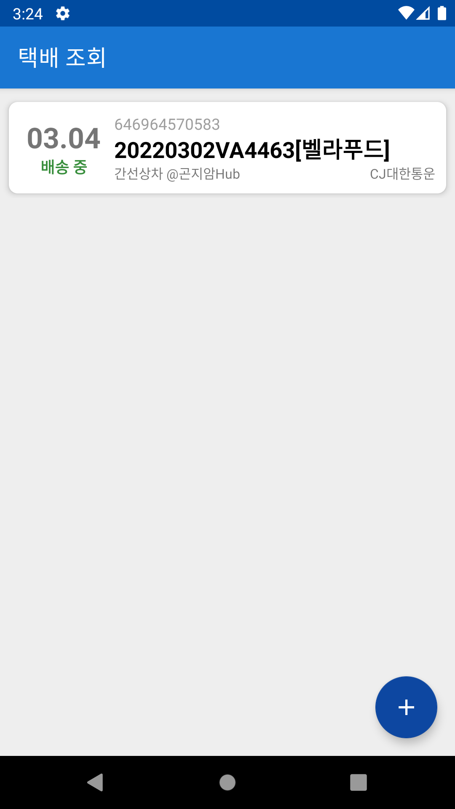
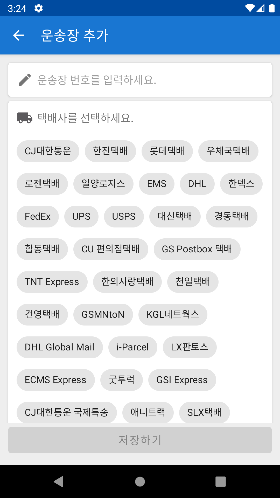
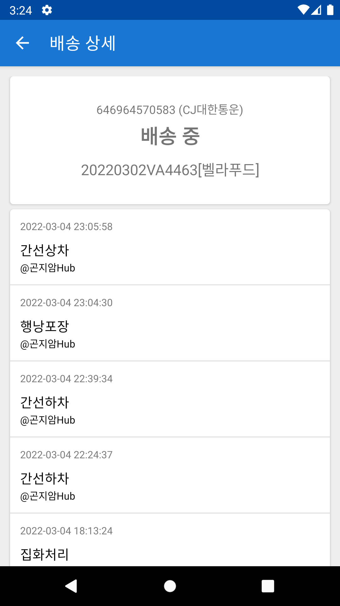

# Android Clone Coding Project #28 Delivery
택배 목록 불러오기
 
택배사 목록 불러오기
 
입력받은 운송장 추가하기
 
운성장 추가 화면 구현
 
클립보드에 있는 운송장 추가 기능
 
배송 상세 화면 구현
 
배송 출발한 택배 안내 기능
 

# 결과화면
|추천 영화|영화 목록|영화 리뷰|
|---|---|---|
||||
 

# 배운 내용 정리
- MVP
- Jetpack Navigation
- Koin
- Room
- WorkManager
